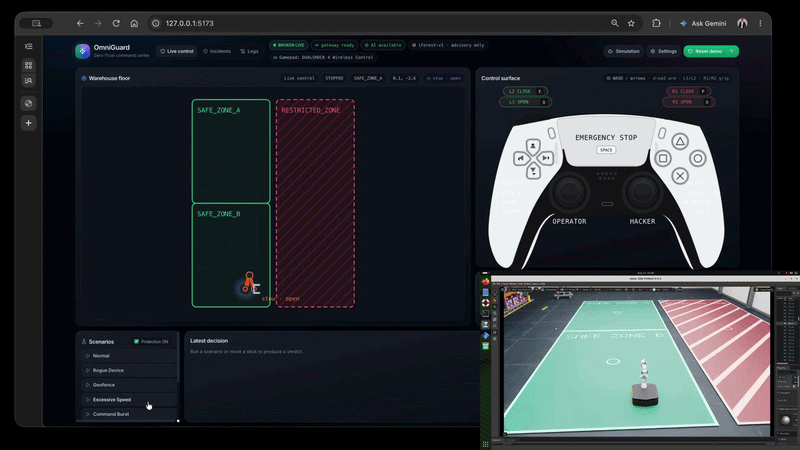
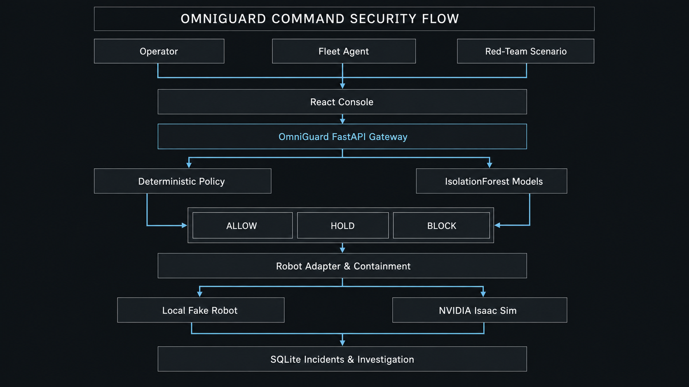
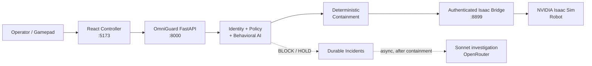

<div align="center">

# OmniGuard — Zero Trust for Physical AI

**A cyber-physical security gateway that evaluates every robot action, detects unsafe behavioral sequences, and contains compromised control before it reaches real hardware.**

> The credential may be valid. The intent may not be.

NVIDIA Isaac Sim provides the physically accurate digital twin. OmniGuard turns it into a cyber-physical red-team and pre-deployment security-validation environment.

[React controller](#react-controller-primary) · [Architecture](#architecture) · [Quick start](#quick-start) · [Isaac Sim](#isaac-sim-digital-twin) · [Docs](#documentation)

</div>

<p align="center">
  
</p>

---

## Why OmniGuard exists

A robot credential can authenticate and still be misused. A stolen or replayed token may pass traditional identity checks while a rogue device, restricted-zone target, unsafe speed, or abnormal multi-action sequence drives the machine into harm.

OmniGuard sits **between the controller and the robot**. Before actuation, it evaluates credential state, agent, device, robot, zone, speed, lease validity, and behavioral context. Unsafe commands are blocked and contained through emergency stop, credential revocation, agent quarantine, and durable incident evidence.

For the hackathon, this repository is a safe cyber-physical red-team range: either a local fake robot (no GPU) or an NVIDIA Isaac Sim twin on a private, authenticated bridge.

---

## Same command, two outcomes

| Path | Result |
| --- | --- |
| **Protection OFF** | Individually “legal” commands can still move the robot into unsafe physical outcomes. |
| **OmniGuard ON** | Hard policy and behavioral AI evaluate the same request; unsafe actions are blocked and contained before they reach hardware. |

<p align="center">
  
</p>

The core demos show:

- A **valid credential** used from an **unknown controller** toward a restricted human zone at unsafe speed.
- Individually valid **base / arm / gripper** actions that form an **abnormal manipulation sequence** hard rules alone would miss.
- The difference between an unprotected command path and OmniGuard enforcement.

---

## Surfaces (ports)

| Surface | Port | Role |
| --- | --- | --- |
| **React controller** | **5173** | **Primary** interactive operator / red-team console |
| FastAPI gateway | 8000 | Policy, teleop, scenarios, incidents, containment |
| JWT broker (optional) | 8001 | Signed, expiring credentials (`broker/`) |
| Streamlit dashboard | 8501 | Fallback / four-button demo UI |
| Isaac command bridge | 8899 | Private authenticated bridge — **never exposed to the browser** |
| Landing site | 5174 | Product marketing + scripted `/demo` preview |

The browser talks only to OmniGuard on `:8000`. It never receives the Isaac bridge token and never calls `:8899`.

---

## Core capabilities

Implemented in this repository:

- **Dual control planes** — legitimate operator vs rogue controller (same APIs; backend enforces rejection)
- **Mouse, keyboard, and physical gamepad** teleoperation
- **Base movement**, **arm presets**, and **gripper** actions
- **Deadman timeout** and emergency stop
- **Zone-aware** movement and speed limits
- **Scenario catalogue** (rogue device, geofence, overspeed, burst, combined, AI anomaly, revoked replay, malicious manipulation)
- **Live risk evidence** on every decision
- **Durable incidents** with correlation across a demo run
- **Investigation console** (bounded tools + async LLM explanation)
- **Session history** and evidence export
- **Credential revocation** and **agent quarantine**
- **Human feedback** and **controlled / simulated recovery**

Deep controller detail: [ui-controller/README.md](ui-controller/README.md).

---

## AI intelligence vs deterministic safety

> **AI can add risk evidence, but it can never relax a hard safety policy.**

| Layer | Responsibility |
| --- | --- |
| 1. Identity, device & lease verification | Credential fingerprint, agent, device, robot, teleop lease, sequence, rate limits |
| 2. Deterministic hard safety policy | Unknown device, restricted zone, excessive speed, revoked / unauthorized identity |
| 3. Command-level IsolationForest | Scores a single movement command’s feature vector |
| 4. Action-window IsolationForest | Scores a rolling multi-action window (base / arm / gripper) |
| 5. Behavioral sequence rules | Deterministic manipulation-burst rule (separate from ML score) |
| 6. Effective-risk orchestration | `effective_risk = max(ml, rule)`; honest `decision_source` |
| 7. Deterministic containment | Allowlisted playbooks: E-stop, revoke, quarantine, session terminate |
| 8. Durable incident creation | SQLite incidents, correlation, no raw credentials stored |
| 9. Asynchronous Sonnet investigation | Explains **after** containment — never on the real-time path |
| 10. Human feedback & recovery | Operator classification + simulated IdP recovery (runtime restore is explicit) |

**Non-negotiable:**

- The **LLM never moves the robot**.
- Physical stop, revocation, and quarantine remain **deterministic**.
- Sonnet investigates **only after** containment.
- Incidents and feedback are **persisted**.
- The system does **not** automatically retrain or promote policies.
- Model or policy changes require **offline evaluation and human approval**.

<p align="center">
  
</p>

---

## Architecture



Laptop / CI path uses the same API with `simulator/fake_robot.py` instead of Isaac.

---

## Verified containment evidence

Recorded demo containment for a valid-identity manipulation sequence (action-window path):

| Field | Value |
| --- | --- |
| Incident | `INC-22B365460A` |
| Status | `CONTAINED` |
| Decision source | `behavioral_rule` |
| Playbook | `UNSAFE_MANIPULATION_SEQUENCE` |
| IsolationForest risk | `0.49` |
| Behavioral rule score | `0.92` |
| Effective risk | `0.92` |
| Bridge acknowledgement | `EXECUTED` |
| Credential | `REVOKED` |
| Agent | `QUARANTINED` |

Honest reading: a **hybrid ML-plus-behavioral-rule** engine blocked the sequence. IsolationForest alone was sub-critical; the deterministic burst rule drove `effective_risk` over the enforcement threshold.

---

## Scenarios available

| ID | What it demonstrates |
| --- | --- |
| `normal` | Trusted operator, safe destination — ALLOW |
| `rogue_device` | Unknown device — hard-policy BLOCK |
| `geofence` | Restricted / human zone — hard-policy BLOCK |
| `excessive_speed` | Over max speed — hard-policy BLOCK |
| `command_burst` | Burst / warning band — HOLD |
| `combined_attack` | Multiple hard violations — BLOCK |
| `behavioral_anomaly` | Command-level AI risk with valid identity — BLOCK |
| `revoked_replay` | Replay after revoke — BLOCK |
| `valid_identity_malicious_manipulation` | Legal base/arm/gripper window → abnormal sequence — BLOCK |

---

## Quick start

**Requirements:** Python 3.10+, Node.js 20.19+, Bash.  
**Robot backends:** local fake robot (no GPU) **or** NVIDIA Isaac Sim digital twin.

### 1. API + local robot + Streamlit fallback

```bash
bash scripts/setup.sh
bash scripts/run_demo.sh
```

| Service | URL |
| --- | --- |
| API docs | http://127.0.0.1:8000/docs |
| API health | http://127.0.0.1:8000/health |
| Streamlit fallback dashboard | http://127.0.0.1:8501 |

Keep this terminal running.

### 2. React controller (primary)

```bash
cd ui-controller
npm ci
npm run dev
```

Open **http://127.0.0.1:5173** — legitimate and rogue planes, keyboard/gamepad, scenarios, decision traces, incidents, investigation, and session export.

### Optional paths

| Path | How |
| --- | --- |
| Landing site | `cd landing && npm ci && npm run dev` → http://localhost:5174 |
| JWT broker | `bash scripts/run_jwt_broker.sh` → `:8001` |
| Isaac Sim | See [Isaac Sim digital twin](#isaac-sim-digital-twin) |

---

## React controller (primary)

The React `ui-controller` is the preferred judge and operator experience:

- Dual **legit / rogue** control planes (real backend requests on both sides)
- Stick, keyboard, and DualSense-style gamepad bindings
- Teleop leases with deadman, sequence validation, and fail-closed stop
- Scenario runner, live risk strip, incident center, investigation, feedback, recovery
- Credentials stay **in memory** (never `localStorage`); the UI never holds the bridge token

Full contract and controls: [ui-controller/README.md](ui-controller/README.md).

Streamlit on `:8501` remains available as the **fallback / four-button** demo dashboard started by `run_demo.sh`.

---

## Isaac Sim digital twin

1. Close extra Isaac GUIs — keep one scene.
2. From a **DCV** terminal (needs `DISPLAY`):

```bash
/opt/IsaacSim/python.sh /path/to/omniguard/isaac/warehouse_robot_demo.py
# wait for: OmniGuard Isaac bridge listening on :8899
```

3. In another shell (**do not** use `run_demo.sh` — it starts the fake robot):

```bash
bash scripts/run_isaac_services.sh
```

4. From a Mac operator laptop, forward ports as needed: [docs/MAC_ACCESS.md](docs/MAC_ACCESS.md).

Details: [isaac/README.md](isaac/README.md).

---

## Mac access through SSM

Operators can keep the React UI or Streamlit on localhost while the GPU host runs Isaac. Follow [docs/MAC_ACCESS.md](docs/MAC_ACCESS.md) for SSM port-forward patterns. Prefer forwarding **5173** (React) and **8000** (API); keep **8899** private on the GPU host.

---

## Optional LLM configuration

Default is deterministic fallback (no live model). For hackathon OpenRouter / Sonnet explanations **after** containment, set values in a **local** `.env` (gitignored — never commit keys):

```bash
cp .env.example .env
# LLM_PROVIDER=openrouter
# OPENROUTER_API_KEY=<machine-local only>
# OPENROUTER_MODEL=anthropic/claude-sonnet-4.6
```

Investigation runs asynchronously (bounded pool). Containment does not wait on Sonnet. See `.env.example` and [docs/RUNBOOK.md](docs/RUNBOOK.md).

---

## Target industries

| Industry | Use case |
| --- | --- |
| Warehousing and logistics | Protect AMR fleets from rogue control, restricted-zone entry, replay, and unsafe speed. |
| Manufacturing | Govern mobile manipulators using identity and safety context. |
| Healthcare robotics | Constrain service robots to approved areas and surface unusual behavior. |
| Critical infrastructure | Control autonomous inspection where incorrect actions disrupt essential operations. |

---

## What works today

| Layer | Status |
| --- | --- |
| Zero-Trust policy + deterministic containment | Working |
| Command-level IsolationForest | Working |
| Action-window IsolationForest + behavioral rules | Working |
| React operator console (`:5173`) | Working |
| Streamlit fallback dashboard (`:8501`) | Working |
| Fake-robot laptop path (no GPU) | Working |
| Isaac Sim bridge move / E-stop (`:8899`) | Working on private GPU hosts; keep the bridge private and authenticated |
| Durable incidents, feedback, simulated recovery | Working |
| Async Sonnet / OpenRouter explanation | Optional via env; defaults to labeled fallback |
| Mac browser via SSM port-forward | Documented |
| Production IAM / certified fleet controller | Out of scope for hackathon |

---

## Repository structure

```text
backend/         Policy, scoring, teleop, containment, incidents, investigation
ui-controller/   Primary React operator / red-team console (:5173)
landing/         Product site + scripted preview (:5174)
dashboard/       Streamlit fallback dashboard (:8501)
broker/          Optional JWT command broker (:8001)
isaac/           Isaac Sim warehouse demo + authenticated command bridge
simulator/       Local fake robot for laptop / CI
artifacts/       Trained IsolationForest models + metadata
config/          Risk / action policy YAML
scripts/         Setup, launch, training, and demo utilities
docs/            Runbook, Mac access, demo script, alignment notes
tests/           Backend, UI, containment, and bridge tests
assets/          README demo GIFs and architecture still
```

---

## Documentation

| Doc | Contents |
| --- | --- |
| [ui-controller/README.md](ui-controller/README.md) | Primary console contract, controls, security boundary |
| [isaac/README.md](isaac/README.md) | Isaac launch and bridge |
| [landing/README.md](landing/README.md) | Marketing site |
| [docs/RUNBOOK.md](docs/RUNBOOK.md) | Operator runbook |
| [docs/MAC_ACCESS.md](docs/MAC_ACCESS.md) | SSM / laptop access |
| [docs/demo-script.md](docs/demo-script.md) | Judge demo narrative |
| [docs/ALIGNMENT.md](docs/ALIGNMENT.md) | Hackathon alignment notes |

---

## Test

```bash
source .venv/bin/activate
pytest -q

cd ui-controller
npm test
npm run build
```

Run these locally before citing pass counts in a submission.

---

## Hackathon scope and safety limitations

OmniGuard is a **demonstrator**, not a production robot safety system or certified controller.

- Default API credentials are for **private development machines** only.
- The Isaac bridge (`:8899`) must stay **private** and authenticated; the browser must never hold its token.
- AI scores and explains; it does **not** override hard policy or issue motion commands.
- Production use would require hardened device identity, fleet-specific adapters, distributed state, network isolation, and independent safety certification.

---

<div align="center">

**OmniGuard** — evaluate every action. Contain before impact.

</div>
